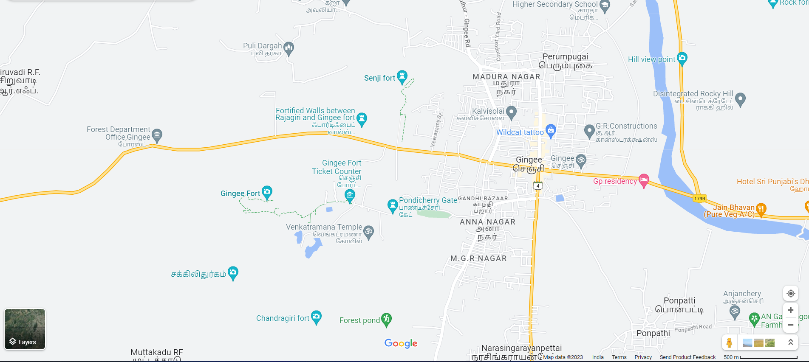

# Ex04 Places Around Me
## Date:18.11.23
## AIM
To develop a website to display details about the places around my house.

## DESIGN STEPS

### STEP 1
Create a Django admin interface.

### STEP 2
Download your city map from Google.

### STEP 3
Using ```<map>``` tag name the map.

### STEP 4
Create clickable regions in the image using ```<area>``` tag.

### STEP 5
Write HTML programs for all the regions identified.

### STEP 6
Execute the programs and publish them.

## CODE
```
<html>
    <head>
        <title>MY city</title>
        <style>
            .c1{
                color:darkblue;
                text-align: center;}
                .c2{
                    text-align: center;color: red;
                }

        </style>
    </head>
    <body>
        <h1 class="c1">Gingee</h1>
        <h1 class="c2">Iyalarasu</h1>
        <center>
        
    
        <map name="Mycity">
        <area shape="rect" coords="900,450,950,500" href="town.html" title="My Home Town">
        <area shape="rect" coords="700,100,750,150" href="rani.html" title="Rani fort">
        <area shape="rect" coords="200,150,600,650" href="raja.html" title="Raja fort">
        <area shape="rect" coords="1150,780,1160,710" href="bus.html" title="Bus stand">
        <area shape="rect" coords="460,750,530,700" href="saradha.html" tilte="saradha school"
    </map>
    </center>

    </body>
</html>
```
town.html
```
<html>
    <head><title>home Town</title></head>
    <style>
        *{background-color:brown;

        }
        h1{
            text-align: center;
            color:aqua
        }
        h2{
            text-align: center;
            color:green
        }
        
    </style>
    <body >
        <h1>Gingee</h1>
        <h2><u>My Home Town</u></h2>
        <hr color="pink">
        <h3><p><i>
            Gingee is a town located in the Viluppuram district of the Indian state of Tamil Nadu. It is known for the historic Gingee Fort, also called Senji Fort or Chenji Fort, which is one of the most formidable fortifications in Tamil Nadu. The town has a rich historical and cultural heritage.
            
            Key features and points of interest in Gingee include:
            
            Gingee Fort: A historic fortress complex spread across three hills – Krishnagiri, Rajagiri, and Chandrayandurg. The fort has various structures, including temples, granaries, and defensive walls.
            
            Temples: Gingee has several ancient temples that reflect the architectural and cultural heritage of the region.
            
            Cultural Heritage: The town is steeped in history and has witnessed the rule of various dynasties, including the Cholas, Nayaks, Marathas, and Mughals.
            
            Local Economy: The economy of Gingee is primarily based on agriculture and local businesses. The town serves as a center for trade and commerce in the surrounding areas.
            
            Connectivity: Gingee is well-connected by road to nearby towns and cities. It may have a bus stand and other transportation facilities.
            
            It's worth noting that the specifics about Gingee and its features may change, and for the most current and detailed information, it's recommended to refer to local sources, travel guides, or official town websites.
            
            
            
            
            
            </i></p></h3>
    </body>
</html>

```
rani.html

```
<html>
    <head><title>Rani fort</title></head>
    <style>
        *{background-color:red;

        }
        h1{
            text-align: center;
            color:green
        }
        h2{
            text-align: center;
            color:pink
        }
        
    </style>
    <body >
        <h1>Gingee</h1>
        <h2><u>Rani Fort</u></h2>
        <hr color="yellow">
        <h3><p><i>As of my last knowledge update in January 2022, there isn't a specific "Rani Fort" widely known in historical or geographical contexts. It's possible that the term refers to a local or lesser-known fort with the name "Rani," and details about such places might not be readily available in general knowledge sources.

            If "Rani Fort" is a more recent development or a specific location, I recommend checking local sources, travel guides, or official tourism websites for the most accurate and up-to-date information about this fort. Geographical names and landmarks can sometimes change or have variations that may not be widely recognized in broader contexts.</i></p>


        </p></h3>
    </body>
</html>

```
raja.html
```
<html>
    <head><title>Raja fort</title></head>
    <style>
        *{background-color:cyan;

        }
        h1{
            text-align: center;
            color:blueviolet
        }
        h2{
            text-align: center;
            color:peru
        }
        
    </style>
    <body >
        <h1>Gingee</h1>
        <h2>Raja Fort</h2>
        <hr color="yellow">
        <h3><p>Gingee Fort, also known as Raja Fort, is a historic fortress situated in the town of Gingee in Tamil Nadu, India. Renowned for its architectural grandeur and strategic location, the fort stands atop three prominent hills – Krishnagiri, Rajagiri, and Chandrayandurg. Dating back to the 13th century, it has witnessed the rule of various dynasties, including the Cholas, Nayaks, Marathas, and the Mughals. The fort complex encompasses a series of structures, such as granaries, temples, and military buildings. Notable features include the imposing Kalyana Mahal, a granary with a massive storage capacity, and the impressive Rajagiri and Krishnagiri forts, showcasing the rich historical tapestry of Gingee.


        </p></h3>
    </body>
</html>


```
bus.html
```
<html>
    <head><title>bus</title></head>
    <style>
        *{background-color:blue;

        }
        h1{
            text-align: center;
            color:darkred;
        }
        h2{
            text-align: center;
            color: orange;
        }
        
    </style>
    <body >
        <h1>Gingee</h1>
        <h2>bus stop</h2>
        <hr color="red">
        <h3><p>Gingee Bus Stand is a vital transportation hub located in Gingee, Tamil Nadu, India. Serving as a pivotal point for regional connectivity, it facilitates the smooth movement of passengers and goods. The bus stand is strategically positioned to link Gingee with neighboring towns and cities, playing a crucial role in the local transportation network. Commuters rely on the Gingee Bus Stand for daily travel, making it a bustling center of activity. The facility likely offers various amenities such as ticket counters, waiting areas, and passenger services, contributing to the overall convenience of travelers passing through this important transit point.</p></h3>
    </body>
</html>

```
saradha.html
```
<html>
    <head><title>Saradha school</title></head>
    <style>
        *{background-color:palegreen;

        }
        h1{
            text-align: center;
            color:red
        }
        h2{
            text-align: center;
            color:yellow
        }
        
    </style>
    <body >
        <h1><b>Gingee</b></b></h1>
        <h2><u>Saradha school</u></h2>
        <hr color="">
        <h3><p><i>As of my last knowledge update in January 2022, I don't have specific information about a school named "Saradha School." School names can be relatively common, and there might be several institutions with similar names around the world.

            If "Saradha School" is a specific school you are inquiring about, I recommend checking local directories, education department websites, or the school's official website for the most accurate and up-to-date information. Additionally, local news sources or educational organizations may provide details about schools in specific regions. Keep in mind that specific details about individual schools can change, so the latest and most accurate information can be obtained from local sources.</i></p></h3>
    </body>
</html>
```


## OUTPUT



.png>)


## RESULT
The program for implementing image maps using HTML is executed successfully.
